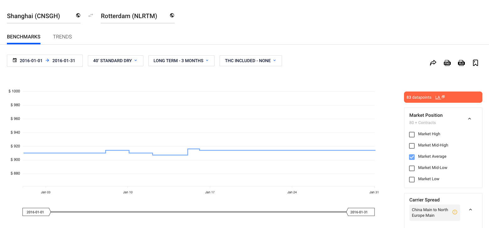

# Assignment

The assignment ahead of you comprises 2 main tasks. Please read both of them carefully and remember to work on both.

- In [Task 1](#task-1) we ask you to implement a web page that visualizes the data returned by the [API](#api-description).
- In [Task 2](#task-2), describe how would you approach extending the functionality of the page according to the new requirements.

## Task 1

Create an interactive web page that visualizes how average, low and high prices change over time on a selected trade-lane, for a customizable date range. Our stack is based on D3, ReactJS, Redux and Webpack, but you are free to choose anything you like.

The user of the page should be able to search for origin and destination ports, pick the date range they are interested in, and when those are chosen the user should see a graph that displays average, low and high market prices over time. This is how this looks in our platform:



If you think there is a different way of visualization that serves the task better, feel free do do it your own way – we only present this screenshot as an example.

## Task 2

Imagine that users now want to be able to download the visualization from [Task 1](#task-1) as an image that they can later embed in their presentations and reports. Users want the image to include the graph of the selected price and the color-coded legend.

Describe, using a couple of paragraphs, how you would solve this new user problem. If you can think of alternative solutions, describe them along with their trade-offs.


# Extra details

* Keep your solution in a Version Control System of your choice. **Provide the solution as a public repository that can be easily cloned by our development team.**
* Provide any instructions needed to set up the system in `README.md`.
* Ensure the page handles errors and edge cases properly.
* If you have any questions, please don't hesitate to contact us at tech-recruitment@xeneta.com
* Please let us know how much time you spent on the task, and of any difficulties that you ran into.

# API Description

We provide you with an API that serves a simplified subset of real-world data.

## Authorization

API is protected by an unique API key, which is sent to you along with this task specification. If you have not received your API key, do not hesitate to contact us at tech-recruitment@xeneta.com .

To authorize with the API, send `X-Api-Key=<your-api-key>` header in the API request.

## Ports API

This API endpoint returns ports that are available in the system. Information about each port includes:

- 5-character port code
- Human-friendly port name

Example:

```
curl -H 'x-api-key: <your-api-key>' https://685rp9jkj1.execute-api.eu-west-1.amazonaws.com/prod/ports


[
    {
        "code": "CNSGH",
        "name": "Shanghai"
    },
    {
        "code": "NLRTM",
        "name": "Rotterdam"
    },
    ...
]

```


## Market rates API

This API endpoint returns market average, low and high prices of shipping a container on certain days between two ports that are sent to the API as parameters.

API parameters are:

- `origin`, `destination`: 5-character port codes, origin and destination ports respectively

Example:

```
curl -H 'x-api-key: <your-api-key>' 'https://685rp9jkj1.execute-api.eu-west-1.amazonaws.com/prod/rates?origin=CNSGH&destination=NLRTM'

[
    {
        "day": "2021-01-01",
        "mean": 500,
        "low": 100,
        "high": 800
    },
    {
        "day": "2021-01-02",
        "mean": null,
        "low": null,
        "high": null
    },
    {
        "day": "2021-01-03",
        "mean": 600,
        "low": 100,
        "high": 900,
    },
    ...
]
```
